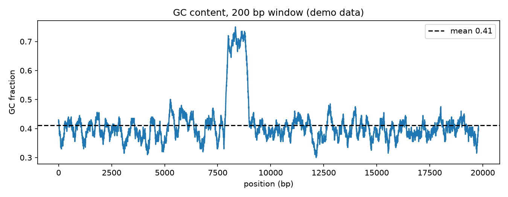

# Gc Content Sliding Window

A flat GC line means a boring genome. Every bump and dip means something — a promoter, a repeat, a horizontally transferred gene, or an assembly gone wrong.

## Why This Matters

GC content is one of the cheapest, most informative summaries of a sequence. Local GC spikes mark CpG islands and promoters; broad shifts mark isochores or foreign DNA; sudden discontinuities often mark misassemblies. A sliding-window profile makes all of it visible at a glance before you commit to deeper analysis.

## How It Works

1. Slide a fixed window along the sequence.
2. Compute the GC fraction in each window.
3. Plot the profile and compare local features to the mean.

## What the Demo Shows



The demo plants a GC-rich island in an otherwise GC-poor sequence. The profile sits near 0.4 and spikes to ~0.7 over the island — the same signal you would chase as a candidate promoter or CpG island.

## Run It

```bash
pip install -r requirements.txt
python demo.py
```

> Demonstrated on synthetic data, so it's fully reproducible with no external downloads.
